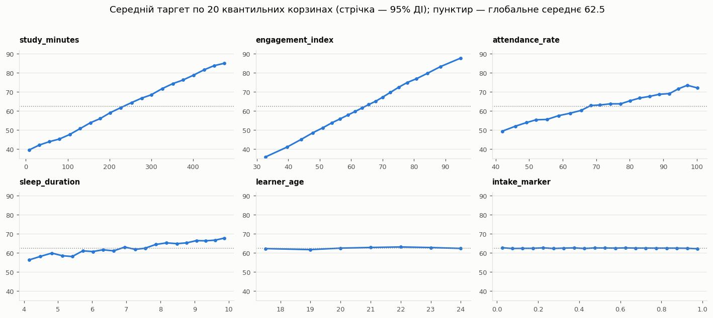
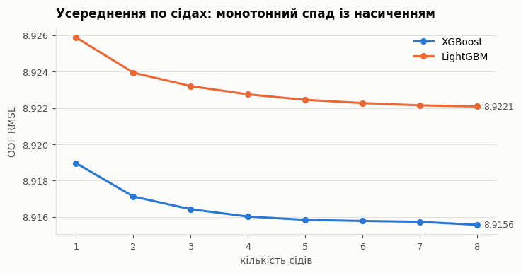

# Predicting Assessment Scores — технічний звіт

**Автор:** Остап Миних · UCU AI 2026, Homework 1
**Метрика:** RMSE · **Код:** `notebooks/01_eda.ipynb` … `05_final_submission.ipynb`, модулі в `src/`


**Фінальний результат:** я подаю два сабмішни з усередненням по сідах — стек **8.9152**
і одиночний XGBoost **8.9156** за OOF (розділ 6.3). Їхні односідові версії перевірені на
незайманому holdout: 8.9133 і 8.9147.


---

## Задача і дані

Треба побудувати регресійну модель, що прогнозує `assessment_score` — підсумковий бал
студента. Метрика змагання — RMSE на тестовому наборі.

Дані складаються з чотирьох файлів: `train.csv` (441 000 рядків із відомим балом),
`test.csv` (189 000 рядків, бал приховано, саме для них подається сабмішн),
`unlabeled.csv` (270 000 рядків без балу, необов'язковий матеріал, який я використав у
5.4) і `sample_submission.csv`, що задає формат `record_id,assessment_score` та порядок
ідентифікаторів.

Кожен рядок описує одного студента п'ятнадцятьма фічами. Числових сім: `study_time`,
`study_minutes`, `attendance_rate`, `engagement_index`, `sleep_duration`, `learner_age`,
`intake_marker`. Категоріальних вісім: `program_track`, `rest_quality`,
`learning_routine`, `campus_resources`, `gender_group`, `assessment_level`,
`home_internet`, `registration_group`. `record_id` — службовий ідентифікатор рядка, у
фічі він не входить (перевіряється assert'ом у `src/config.py`).

Спостережений діапазон таргета — [19.599, 100.0] при середньому 62.51 і σ 18.92; розподіл
симетричний, тому я оптимізую RMSE напряму, без трансформації таргета.

---

## 1. Методологія

### 1.1. Розбиття даних

Я розділив розмічені дані на дві частини: `train_dev` (396 900 рядків), на якій робиться
вся розробка — крос-валідація, вибір моделі, фіч і гіперпараметрів, і `holdout`
(44 100 рядків), який я не читав до самого фіналу й використав один раз для незалежної
оцінки. Тестовий набір для сабмішну — 189 000 рядків.

Holdout відрізається в `src/data.py` до першого перегляду даних, включно з EDA. Мотивація
проста: крос-валідацію я використовую десятки разів для відбору, тому фінальний CV-скор є
development estimate, а не незалежною оцінкою.

### 1.2. Протоколи оцінювання

Усі числа в роботі отримані однією функцією `src/cv.py::run_cv`. Протоколів два, і я їх не
змішую:

- **Protocol A (benchmark)** — `KFold(5, shuffle=True, random_state=42)` на повних
  396 900 рядках. Усі числа в порівняльних таблицях.
- **Protocol B (search)** — 3 фолди на фіксованій підвибірці 150 000. Лише для ранжування
  конфігурацій; переможець завжди переміряється за Protocol A.

Числа з різних протоколів я ніколи не порівнюю між собою.

Звітую `mean ± std` по фолдах і RMSE по всьому OOF-вектору. Вони не зобов'язані збігатися,
бо RMSE нелінійна.

### 1.3. Захист від витоку

Детерміновані операції — нормалізацію категорій, арифметику фіч, `clip` до меж із
предметної області — я виконую до CV. Усі навчені перетворення (`SimpleImputer`,
`StandardScaler`, `OneHotEncoder`) лежать у `sklearn.Pipeline` і фітуються лише на
навчальній частині кожного фолду.

`run_cv` приймає фабрику моделі, а не готовий об'єкт: інакше на другому фолді модель
дофітувалася б поверх стану з першого.

Early stopping у бенчмарках я не використовую, кількість раундів зафіксована пошуком.
Величину відповідного зміщення виміряв окремо, див. 3.5.

---

## 2. Data understanding (ноутбук 01)

Повний перелік «спостереження → рішення» лежить у розділі 10 ноутбука. Нижче те, що
вплинуло на пайплайн.

### 2.1. Якість даних

**Неузгодженість категорій.** `program_track`, `rest_quality`, `learning_routine` містять
двійників із ведучим пробілом і UPPERCASE, разом 17 385 рядків. Без нормалізації one-hot
створив би дублікати колонок. Я додатково перевірив, чи «брудність» корелює з таргетом:
`learning_routine` дав z = −2.46 при порозі Бонферроні 2.39 (гранично), решта шум. Розмір
ефекту 0.6 бала, тому прапорець брудності у фічі не брав.

**`study_time` пошкоджений множником 4.** `study_time` і `study_minutes` — одна величина:
r = 0.9485, медіана залишку `minutes − 60·hours` рівно 0. Але 804 рядки мають `study_time`
до 32.24 год при фізичній стелі `study_minutes` 528 хв = 8.8 год. Серед цих рядків
множник `study_time / (study_minutes/60)` центрований на 4.00 (медіана 3.9991, σ 0.18),
тож `study_time / 4` відновлює години з RMSE 11.6 хв, тобто на рівні власного шуму
вимірювання. Поріг 9.2 год ловить лише ~74% пошкоджених рядків: ті, де справжнє значення
менше за 2.3 год, після множення лишаються правдоподібними.

Непряме підтвердження: у `study_time` Pearson з таргетом 0.7258 проти Spearman 0.7675,
тоді як у `study_minutes` вони рівні (0.7601 / 0.7677). Spearman працює з рангами й
нечутливий до величини викиду, тому розрив між коефіцієнтами є прямим його відбитком.

**Таргет цензурований.** Точкові маси рівно на 100.0 (2.46% рядків) і рівно на 19.599
(1.00%). Через це клампінг прогнозів я роблю в `[19.599, 100.0]`, а не `[0, 100]`.

Викиди поза фізичними межами: `engagement_index` > 100 (1 328 рядків), `study_time` > 9
(849), `attendance_rate` > 100 (682).

### 2.2. Структура сигналу

**Сім із п'ятнадцяти фіч не пов'язані з таргетом:** `intake_marker` (r = −0.0012),
`learner_age` (0.0109), і категоріальні `program_track` (розмах середніх 1.22),
`gender_group` (0.46), `assessment_level` (0.42), `registration_group` (0.29),
`home_internet` (0.00).

**`engagement_index` — похідна фіча.** На 95.7% вона пояснюється рештою числових фіч
(`study_minutes` + `attendance_rate` самі дають R² = 0.9565). Вирішальна перевірка:
кореляція залишку цієї регресії з таргетом — 0.0287, тоді як у самої фічі 0.7355. Зв'язок
із таргетом позичений. VIF = 23.2.

Непряме підтвердження дає форма розподілів: усі базові фічі розподілені рівномірно, що є
ознакою генерації, а `engagement_index` — дзвоноподібно, як сума кількох рівномірних за
центральною граничною теоремою.

**Зв'язки майже лінійні.** Pearson ≈ Spearman для всіх фіч; середній таргет по 20
квантильних корзинах росте рівними кроками. Із цього я зробив три передбачення, перевірені
в розділі 3.



**Пропуски MCAR.** 2–3% у кожній фічі; максимальний |z| різниці середніх таргета між
групами з пропуском і без — 1.85 при 15 перевірках, тоді як під нульовою гіпотезою
очікується ≈ 2.1. Середнє й дисперсія кількості пропусків у рядку збігаються з
незалежними індикаторами.

**Зсуву train/test немає:** adversarial ROC-AUC = 0.5001 ± 0.0027, тобто звичайний `KFold`
валідний. Саму перевірку (adversarial validation) я взяв із практики Kaggle-змагань [1].

### 2.3. Методичні зауваження

**Вбудована важливість фіч вводить в оману.** У LightGBM `sleep_duration` посідає 1-ше
місце з 15 за кількістю сплітів, але 8-ме за перестановкою; `intake_marker` — 4-те за
сплітами при від'ємній (−0.009) важливості за перестановкою. Причина в тому, що неперервні
фічі з високою кардинальністю пропонують багато точок розрізу: `intake_marker` має
319 732 унікальні значення на 396 900 рядків. Для відбору фіч я використовую permutation
importance.

**Виправлена помилка власної перевірки.** Перший варіант детектора «брудних» категорій
використовував критерій `s != s.str.lower()` і позначив усі 389 000 рядків
`registration_group` як помилкові, хоча там `G01`…`G12` є канонічним форматом. Агрегат дав
фальшиве z = −6.84. Коректний критерій — двійник: значення, чия нормалізована форма
присутня в колонці окремо.

---

## 3. Обов'язкові порівняння моделей (ноутбук 02)

Усі моделі навчені на фіче-сеті v0 (15 фіч), на однакових фолдах і з однаковим
препроцесингом: медіанна й модальна імпутація плюс one-hot, скейлінг лише для лінійних.

### 3.1. Зведена таблиця (Protocol A)

Нижче всі результати разом; розбір кожного рядка — у підрозділах 3.2–3.5.

| модель | OOF RMSE | mean ± std | train | розрив | час, с ¹ |
|---|---:|---|---:|---:|---:|
| константа = середнє фолду | 18.9184 | 18.9183 ± 0.0431 | 18.9183 | 0.000 | 0.0 |
| LinearRegression | 9.2476 | 9.2476 ± 0.0242 | 9.2458 | 0.002 | 3.1 |
| Ridge (RidgeCV, α = 31.6) | 9.2476 | 9.2476 ± 0.0242 | 9.2458 | 0.002 | 6.1 |
| Lasso (LassoCV) | 9.2480 | 9.2479 ± 0.0239 | 9.2468 | 0.001 | 4.0 |
| Decision Tree, без обмежень | 13.1151 | 13.1151 ± 0.0272 | 0.0000 | 13.115 | 16.0 |
| Decision Tree, налаштоване | 9.5378 | 9.5378 ± 0.0185 | 8.8555 | 0.682 | 10.8 |
| Random Forest, 100 дерев | 9.2389 | 9.2388 ± 0.0166 | 3.4568 | 5.782 | 153.7 |
| Random Forest, налаштований | 9.0993 | 9.0993 ± 0.0230 | 6.6304 | 2.469 | 111.7 |
| XGBoost, початковий | 9.0153 | 9.0153 ± 0.0209 | 8.5740 | 0.441 | 13.0 |
| **XGBoost, налаштований** | **9.0072** | 9.0071 ± 0.0189 | 8.9436 | 0.064 | 24.2 |
| *XGBoost, нативні категорії* | *8.9429* | *8.9429 ± 0.0179* | *8.8683* | *0.075* | *27.4* |

¹ час на 5 фолдів, Apple M-series 10 ядер; від запуску до запуску коливається на 1–2%.

Останній рядок я виділив курсивом: він використовує інший препроцесинг, без one-hot, тому
в порівняння моделей не входить (див. 5.2).

### 3.2. Baseline

Константний прогноз дає RMSE 18.9183, що тотожно дорівнює σ таргета: RMSE константи
мінімізується при $c=\bar y$ і тоді перетворюється на формулу стандартного відхилення.

Лінійна регресія вдвічі краща. Інтерсепт 62.5052 — прогноз для «середнього» студента,
збігається із середнім таргета. Найбільші коефіцієнти при стандартизованих фічах:
`study_minutes` 8.40, `learning_routine=coaching` 5.45, `rest_quality=poor` −4.40,
`engagement_index` 4.29.

**Обмеження моделі.** Головне — адитивність: взаємодії фіч треба задавати руками. Друге —
чутливість до викидів (розділ 2.1); це єдине обмеження, яке лишилось непротестованим тут і
перевіряється в ноутбуці 03.

**Мультиколінеарність перевірена й виявилася нешкідливою.** Попри VIF 23.2 у
`engagement_index`, коефіцієнти розходяться по п'яти фолдах лише на 0.2–0.9% свого
значення. Причина: VIF — множник дисперсії, а не абсолютна величина, і при n = 317 520
навіть роздута в √23 ≈ 4.8 раза стандартна помилка лишається ≈ 0.08 бала. Ridge це
підтвердив: обравши α = 31.6, він змінив коефіцієнти на 0.001–0.004 і не змінив RMSE.

### 3.3. Decision Tree

Дерево без обмежень дало train RMSE рівно 0 при валідаційному 13.12, тобто підручникове
переобучення. Крива `max_depth` (Protocol B) показує класичний U: від глибини 2 до 10
валідаційна помилка падає з 12.93 до 9.92, далі зростає до 13.24 при `None`, тоді як train
монотонно падає до нуля.


Пошук по сітці 6 × 5 = 30 конфігурацій (`max_depth` × `min_samples_leaf`) дав
`max_depth=16, min_samples_leaf=50`. Переможцем стало глибоке дерево з обмеженням знизу:
обмеження розміру листа виявилось ефективнішим за обмеження глибини, бо діє адресно.

Тюнінг дав **3.58 бала**, найбільший приріст у всьому ноутбуці. Але передбачення з розділу
2.2 підтвердилось: налаштоване дерево програє лінійній регресії (9.5378 проти 9.2476), бо
кусково-константна функція неефективно наближає майже лінійну залежність.

### 3.4. Random Forest

Крива `n_estimators` (10 → 200) монотонно спадає й виходить на плато без жодного підйому.
Це емпіричне підтвердження того, що в лісі кількість дерев не є параметром переобучення.
Дисперсія середнього з $B$ дерев дорівнює $\rho\sigma^2 + (1-\rho)\sigma^2/B$: другий доданок згасає як $1/B$, перший лишається і утворює плато.

Пошук охопив 4 × 3 = 12 конфігурацій, і тут мій прогноз не справдився. Я очікував, що
обмеження `max_features` шкодитиме, бо сильних фіч мало, а оптимумом виявилось
`max_features = 0.3` (9.1833) проти `1.0` (9.2276). Декореляція дерев окупається: виграш
від меншої $\rho$ перевищив втрату від послаблення окремих дерев.

Побічний результат: налаштований ліс має втричі більше дерев (300 проти 100), але
навчається швидше (114 с проти 156 с), бо `max_features=0.3` скорочує перебір порогів, а
`min_samples_leaf=5` обрізає найглибші гілки.

Ліс кращий за налаштоване дерево на 0.44 бала ціною 10-кратного часу. Тюнінг лісу дав лише
0.14 бала проти 3.58 у дерева, тобто ансамбль стійкий до невдалих гіперпараметрів.

### 3.5. XGBoost

Пошук я будував як координатний спуск трьома раундами: **40 конфігурацій** замість 2 160 у
повному grid по тих самих сітках.

Раунд 1 перебирав `learning_rate` ∈ {0.3, 0.1, 0.05, 0.02} × `n_estimators` ∈
{100, 300, 600, 1200} і виграв 0.02 / 1200. Раунд 2 — `max_depth` ∈ {3, 4, 6, 8, 10} ×
`min_child_weight` ∈ {1, 10, 50}, переможець 4 / 50. Раунд 3 — `subsample` ∈
{0.7, 0.85, 1.0} × `colsample_bytree` ∈ {0.6, 0.8, 1.0}, переможець 0.7 / 1.0.

Раунд 1 наочно показує відмінність бустингу від лісу: криві для великих `learning_rate`
досягають мінімуму й піднімаються, тоді як крива лісу в 3.4 лише виходила на плато.
Оптимальна глибина 4 узгоджується з висновком EDA про адитивність зв'язків.

Тюнінг дав лише 0.008 бала (9.0153 → 9.0072), хоча істотно зменшив розрив train/val
(0.44 → 0.06).

**Нативні категорії — несподіваний результат.** Заміна one-hot на `enable_categorical=True`
дала 8.9429, тобто **0.064 бала**, у вісім разів більше за весь тюнінг. Причина: для фічі
з 5 рівнями one-hot дозволяє лише розрізи «одна проти решти» (5 варіантів), а нативне
кодування — будь-яке розбиття на дві підмножини (15). Цей рядок я звітую окремо, бо він
змінює препроцесинг і порушив би вимогу однакових фіч.

**Early stopping: зміщення виміряне.** Вибір точки зупинки на тому ж фолді, де міряється
якість, дав RMSE 9.0571 (1 935 раундів) проти коректного 9.0600 (1 680 раундів), тобто
зміщення 0.003 бала. Воно мале саме тут, бо валідаційний фолд великий (50 000 рядків) і
підлаштуватись під його шум одним параметром майже неможливо. На малому наборі або при
виборі багатьох параметрів ефект був би значно більшим. У бенчмарках early stopping я не
використовую.

### 3.6. Висновки розділу

1. **Усі три передбачення EDA підтвердились:** лінійна регресія відстає від найкращої
   моделі лише на 0.24 бала (2.6%), одиночне дерево програє лінійній, приріст бустингу
   скромний. Форма даних визначила результат, і це було відомо до навчання моделей.
2. Тюнінг дає тим більше, чим менш стійка модель: дерево 3.58, ліс 0.14, XGBoost 0.008.
3. **Подальший тюнінг — глухий кут.** 40 конфігурацій XGBoost дали 0.008, а проста зміна
   кодування категорій — 0.064. Важелі лежать у представленні даних.
4. Розрив train/val не є самостійним діагнозом: у лісу він 5.78 при найкращій на той
   момент валідації.

---

## 4. Feature engineering (ноутбук 03)

**Протокол.** Опорна модель — XGBoost із параметрами, знайденими в 3.5
(`n_estimators=1200`, `learning_rate=0.02`, `max_depth=4`, `min_child_weight=50`,
`subsample=0.7`, `colsample_bytree=1.0`). Параметри моделі, навчальні рядки й фолди
зафіксовані, змінюються тільки фічі, по одній зміні за раз. Контрольна точка v0 = 9.0072.
Обрану зміну я додатково перевіряю на лінійній регресії.

### 4.1. FE-5: пропуск у категорії як окрема категорія

**Мотивація.** Базовий препроцесинг заповнював пропуски в категоріях модою
(`SimpleImputer(strategy='most_frequent')`). Це виглядає нейтральним вибором, але таким не
є: мода приходить разом зі своїм середнім таргетом.

EDA (2.2) встановив, що пропуски MCAR, бо середній бал серед рядків із пропуском дорівнює
глобальному 62.51. Тобто про такого студента не відомо нічого, і коректний прогноз для
нього — середній. Імпутація модою натомість приписує йому характеристику найчастішої
групи.

Я виміряв, наскільки це зміщує прогноз:

| фіча | мода | середній бал моди | зсув від 62.51 | рядків із пропуском |
|---|---|---:|---:|---:|
| `learning_routine` | coaching | 69.26 | **+6.74** | 7 973 |
| `rest_quality` | poor | 57.00 | **−5.51** | 7 893 |
| `campus_resources` | medium | 63.00 | +0.48 | 8 021 |
| `gender_group` | other | 62.73 | +0.22 | 7 995 |
| `assessment_level` | moderate | 62.59 | +0.07 | 7 977 |
| `program_track` | b.tech | 62.56 | +0.04 | 8 085 |
| `home_internet` | yes | 62.51 | −0.00 | 7 896 |
| `registration_group` | g10 | 62.51 | −0.00 | 7 951 |

Тобто для 7 973 студентів модель отримувала хибне твердження «ходив на репетиторство»
(+6.7 бала), а для 7 893 — «погано спить» (−5.5 бала).

**Зміна.** `make_preprocessor(cat_missing='category')`: пропуск стає окремою категорією
`__missing__`. Фіче-сет росте з 45 до 53 one-hot колонок. Модель сама вивчає для цих рядків
середній бал ≈ 62.5.

**Результат за Protocol A, параметри моделей незмінні.** XGBoost покращився з 9.0072 до
**8.9558** (Δ = −0.0514 при std по фолдах 0.0189, тобто 2.7 σ), лінійна регресія — з 9.2476
до **9.1954** (Δ = −0.0522 при std 0.0242, тобто 2.2 σ). Зміна перевищує розкид по фолдах у
2.2–2.7 раза, отже це не шум. Для масштабу: увесь тюнінг XGBoost із 40 конфігурацій (3.5)
дав 0.008, у шість разів менше.

Ефект однаковий для обох моделей (−0.0514 проти −0.0522), і це сам по собі доказ механізму.
Якби виграш походив від нової інформації, яку модель отримала можливість вивчити, він
залежав би від її потужності. Він не залежить, бо інформації не додалося, прибралася
дезінформація, і обидві моделі були введені в оману однаково.

**Ablation — перевірка механізму.** Якщо виграш справді від двох зсунутих колонок, то
застосування `__missing__` лише до них має дати весь ефект, а лише до решти шести —
нічого:

| варіант | OOF RMSE | Δ до v0 |
|---|---:|---:|
| v0, усі модою | 9.0072 | — |
| тільки `rest_quality` + `learning_routine` | 8.9556 | **−0.0516** |
| тільки шість нейтральних | 9.0072 | **−0.0000** |
| усі вісім | 8.9558 | −0.0514 |

Механізм підтверджено однозначно: два зсунуті стовпці дають увесь ефект, шість нейтральних
— рівно нуль до четвертого знака. Виграш не від збільшення розмірності з 45 до 53 колонок.

Побічний результат: якщо потрібна компактніша модель, достатньо застосувати `__missing__`
до двох колонок, тобто 47 ознак замість 53 за той самий результат.

**Рішення:** зміну приймаю, вона входить у базовий фіче-сет для подальших експериментів.
Нова контрольна точка v1 = 8.9558.

**Що варто винести за межі цього датасету.** `most_frequent` не є нейтральним вибором за
замовчуванням. Він нейтральний лише тоді, коли мода близька до «середньої» категорії за
таргетом. Перевірка займає три рядки коду, а ціна недогляду тут склала 0.05 бала, більше
ніж дав увесь перебір гіперпараметрів.

**Відмінність від FE-3 (missing-індикатори).** Індикатор додає колонку «тут був пропуск», і
EDA передбачив, що він не допоможе, бо пропуск не несе інформації про таргет. FE-5 нічого
не додає, а прибирає викривлення, внесене імпутацією. Це зміни різної природи, і очікування
для них різні, тому FE-3 перевіряю окремо.

### 4.2. FE-1: виправлення `study_time`

**Мотивація (2.1).** 804 видимі рядки мають `study_time`, помножений рівно на 4. Я перевірив
три варіанти: (a) `where(study_time > 9.2, study_time/4, study_time)`; (b) те саме плюс
взаємне заповнення пропусків `study_time` ↔ `study_minutes`; (c) плюс окрема
фіча-консенсус.

**Передбачення** з 2.1 і 3.2: ефект має бути асиметричним, помітним для лінійної регресії,
бо викид у 32.24 год при σ = 2.5 є важелем для МНК, і малим для дерев, інваріантних до
монотонних перетворень.

| варіант | XGBoost | Δ | LinearRegression | Δ | у скільки разів сильніше |
|---|---:|---:|---:|---:|---:|
| FE-1a виправлення ×4 | 8.9529 | −0.0029 | 9.1257 | **−0.0697** | **24×** |
| FE-1b + взаємне заповнення | 8.9377 | **−0.0181** | 9.0200 | **−0.1754** | **10×** |
| FE-1c + консенсус | 8.9382 | −0.0176 | — | — | — |

Передбачення підтвердилось точно. Це найчистіший у роботі приклад того, що та сама зміна
фіч по-різному впливає на різні моделі, причому механізм був відомий заздалегідь.

Друге спостереження: основний виграш дає не виправлення масштабу, а взаємне заповнення
пропусків. Пошкоджених рядків 804, а пропусків у парі колонок ~24 000, і вони рідко
збігаються в одному рядку, тож кожна колонка латає іншу.

FE-1c нічого не додав, бо консенсус є лінійною комбінацією двох уже наявних фіч.

Приймаю FE-1b.

### 4.3. FE-2: видалення надлишкових і шумових фіч

| варіант | вхідних фіч | XGBoost | Δ | Linear | Δ |
|---|---:|---:|---:|---:|---:|
| FE-2a прибрати `engagement_index` | 14 | 8.9794 | **+0.0236** | 9.2901 | **+0.0947** |
| FE-2b прибрати 7 шумових | 8 | 8.9545 | −0.0013 | 9.1964 | +0.0010 |
| FE-2c прибрати все | 7 | 8.9788 | +0.0230 | — | — |

**Шумові фічі — передбачення підтвердилось.** Видалення семи фіч із п'ятнадцяти коштує
0.001 на обох моделях. Кандидатів на видалення я відбирав за permutation importance, а не
за вбудованою важливістю; підстава в розділі 2.3, де вбудована метрика ставить шумовий
`intake_marker` на 4-те місце з 15. Виходить безкоштовне спрощення: вхідних фіч майже
вдвічі менше.

**`engagement_index` — моє передбачення було хибним.** У 2.2 я стверджував, що фіча на
95.7% похідна й власної інформації майже не додає. Видалення **погіршує** обидві моделі,
причому лінійну вчетверо сильніше.

Причину розбіжності я встановив вимірюванням. Якщо рахувати надлишковість лише на повних
рядках, як це робив EDA, виходить R² = 0.9566 при σ залишку 3.39 і кореляції залишку з
таргетом 0.029. Якщо ж рахувати з імпутацією, тобто так, як реально працює пайплайн, то
R² = 0.9332, σ залишку 4.21, а кореляція залишку з таргетом зростає до 0.085.

EDA оцінював надлишковість на рядках без жодного пропуску. Але в пайплайні 3% значень
кожної числової фічі заповнені медіаною, і заповнене значення вже не містить інформації, з
якої `engagement_index` можна відновити. Коли `attendance_rate` або `study_minutes`
пропущені, `engagement_index` лишається єдиним носієм цієї інформації для даного рядка. Його
унікальний внесок у дисперсію таргета — 0.72%, що дає очікувану втрату +0.138 для лінійної
моделі проти виміряних +0.095; решта розбіжності від того, що залишок не строго
ортогональний до категоріальних фіч.

XGBoost втрачає вчетверо менше (+0.024), бо може частково відновити величину нелінійними
комбінаціями решти фіч, а лінійна модель обмежена однією фіксованою лінійною комбінацією,
яку вона й так використовує.

**Методологічний висновок:** надлишковість, виміряна на повних рядках, завищує надлишковість
у даних із пропусками. Коректна перевірка — прибрати фічу й поміряти.

Приймаю FE-2b, відхиляю FE-2a.

### 4.4. FE-3: missing-індикатори

Передбачення з 2.2: пропуски MCAR, отже індикатор не несе інформації про таргет і ефект
має бути ≈ 0.

Результат: 8.9528 проти 8.9558, тобто −0.0030 при std по фолдах 0.0152. Це вп'ятеро менше
за розкид, статистично невідрізненно від нуля. Вісім додаткових фіч (15 → 23 вхідних) не
дали нічого. **Відхилено.**

Зіставлення з FE-5 повчальне: обидва експерименти стосуються пропусків, але дали
протилежні результати (−0.051 проти −0.003). Пропуск не містить сигналу, тому додавати
індикатор марно. Але спосіб його заповнення може вносити хибний сигнал, і тоді прибирання
цього сигналу дає реальний виграш.

### 4.5. FE-4: порядкове кодування впорядкованих категорій

`rest_quality` (poor → average → good) і `campus_resources` (low → medium → high) мають
природний порядок, монотонний за таргетом. One-hot його втрачає.

Результат: 8.9559 проти 8.9558 на XGBoost (+0.0001) і 9.1958 проти 9.1954 на лінійній
(+0.0004), тобто нейтрально для обох.

Для дерев це очікувано. Для лінійної моделі пояснення лежить у даних: кроки між
категоріями майже рівні (57.00 → 62.62 → 67.91, тобто +5.62 і +5.29). За рівних кроків
порядкове кодування і one-hot математично еквівалентні, бо один коефіцієнт при 0/1/2
відтворює те саме, що два коефіцієнти при one-hot. Виграш з'явився б за нерівних кроків.
**Відхилено.**

### 4.6. Комбінація та ретюнінг

Набір v2 = v1 + FE-1b + FE-2b, тобто 8 вхідних фіч замість 15.

| крок | OOF RMSE | Δ крок | Δ від v0 |
|---|---:|---:|---:|
| v0 базовий (розділ 3) | 9.0072 | — | — |
| + FE-5 пропуск як категорія | 8.9558 | −0.0514 | −0.0514 |
| + FE-1b `study_time` | 8.9377 | −0.0181 | −0.0695 |
| + FE-2b прунінг шуму (v2) | 8.9376 | −0.0001 | −0.0696 |
| + ретюнінг моделі під v2 | **8.9270** | −0.0106 | **−0.0802** |

Ретюнінг (12 конфігурацій `max_depth` × `min_child_weight`, Protocol B, 72 с) дав
`max_depth=5, min_child_weight=20`. Я виконав його після фіксації фіч і звітую окремим
рядком: зміни фіч дали −0.0696, параметри ще −0.0106.

Для масштабу: тюнінг на старих фічах (3.5) дав 0.008. Внесок фіч виявився майже на порядок
більшим за внесок гіперпараметрів, рівно те, що прогнозував висновок 3.6.

### 4.7. Підсумок усіх експериментів із фічами

| | зміна | XGBoost Δ | Linear Δ | рішення |
|---|---|---:|---:|---|
| FE-5 | пропуск як окрема категорія | **−0.0514** | **−0.0522** | прийнято |
| FE-1b | `study_time` ÷4 + взаємне заповнення | **−0.0181** | **−0.1754** | прийнято |
| FE-2b | прунінг 7 шумових фіч | −0.0013 | +0.0010 | прийнято (спрощення) |
| FE-1c | + консенсус двох вимірів | −0.0176 | — | не додає понад FE-1b |
| FE-3 | missing-індикатори | −0.0030 | — | у межах шуму |
| FE-4 | порядкове кодування | +0.0001 | +0.0004 | нейтрально |
| FE-2a | прибрати `engagement_index` | **+0.0236** | **+0.0947** | погіршує |

Не перевіряв взаємодії фіч (`study × attendance` тощо): EDA показав адитивність зв'язків,
тож очікування низькі.

Фіче-сет v2 і параметри `max_depth=5, min_child_weight=20` фіксую як базову конфігурацію
для розділу 5.

---

## 5. Додаткові експерименти (ноутбук 04)

Чотири напрямки понад обов'язкові чекпоінти. Усе на фіче-сеті v2, на тих самих фолдах,
контрольна точка 8.9270.

### 5.1. LightGBM і CatBoost

**Обґрунтування вибору.** Три реалізації бустингу відрізняються способом росту дерева й
кодуванням категорій: XGBoost будує level-wise, LightGBM — leaf-wise (розщеплює лист із
найбільшим виграшем, дає нижчу помилку за ту саму кількість листків, але легше
переобучується), CatBoost використовує symmetric дерева плюс ordered target statistics
проти витоку при кодуванні категорій.

Конфігурації я взяв зіставні з налаштованим XGBoost: `learning_rate=0.02`, 1200 ітерацій;
`num_leaves=15` у LightGBM ≈ `max_depth=4` (2⁴ = 16 листків); `depth=5` у CatBoost.

| модель | OOF RMSE | train | час, с |
|---|---:|---:|---:|
| XGBoost (еталон) | **8.9270** | 8.8220 | 18.8 |
| LightGBM | 8.9341 | 8.8704 | 21.8 |
| CatBoost | 8.9395 | 8.9174 | 28.2 |

Розкид 0.0125 при std по фолдах 0.017, тобто моделі нерозрізнювані. Їхні переваги
розраховані на складні залежності й категорії високої кардинальності, а розділ 2.2 показав,
що залежності адитивні, і в v2 лишилось три категорії по 3–5 рівнів. Жодна перевага не має
де проявитись.

### 5.2. Розкладання ефекту «нативних категорій» — виправлення висновку розділу 3

У 3.5 нативні категорії дали +0.064 і виглядали як головна знахідка розділу XGBoost. Але те
порівняння змінювало три речі одночасно: кодування категорій, обробку пропусків у
категоріях і обробку пропусків у числових. Розкладаю:

| крок | категорії | пропуски в числових | OOF RMSE | Δ |
|---|---|---|---:|---:|
| A | one-hot | медіанна імпутація | 8.9270 | — |
| B | one-hot | **нативна обробка NaN** | 8.9186 | **−0.0084** |
| C | **нативні** | нативна обробка NaN | 8.9190 | +0.0004 |

**Увесь ефект дає обробка пропусків; власне кодування категорій дає нуль.**

Зіставлення з виміряними в 3.5 +0.064 сходиться: пропуски в категоріях (FE-5, розділ 4.1)
дають ~0.051, пропуски в числових (крок A → B) ~0.008, кодування категорій (крок B → C)
~0.000, разом ~0.059, тобто збігається з 0.064 у межах похибки.

Отже ефект, приписаний у розділі 3 нативним категоріям, майже повністю був ефектом обробки
пропусків — тим самим, який пізніше незалежно знайшовся як FE-5.

Без розкладання висновок звучав би як «нативні категорії корисні» і був би хибним: на v2,
де пропуски вже оброблені коректно, вони не дають нічого.

### 5.3. Блендинг і стекінг

Я дивився на кореляцію залишків, а не прогнозів: прогнози всіх пристойних моделей корелюють
на 0.97+ просто тому, що всі близькі до таргета.

| | XGB | LGBM | CatBoost | RF | Linear |
|---|---:|---:|---:|---:|---:|
| XGB native | 1.000 | 0.998 | 0.996 | 0.984 | 0.986 |
| LGBM native | 0.998 | 1.000 | 0.996 | 0.984 | 0.987 |
| CatBoost | 0.996 | 0.996 | 1.000 | 0.985 | 0.992 |
| RandomForest | 0.984 | 0.984 | 0.985 | 1.000 | **0.979** |
| Linear | 0.986 | 0.987 | 0.992 | **0.979** | 1.000 |

Три бустинги корелюють на 0.996–0.998, тобто помиляються на тих самих рядках. Найнижчі
кореляції у пар із різних сімейств моделей. Тому до ансамблю я додав лінійну регресію й
випадковий ліс, попри те що поодинці вони гірші (9.0210 і 9.0453).

**Захист від двох пасток стекінгу.** Перша: мета-модель мусить вчитися на OOF-прогнозах.
Усі вектори я зберіг через `run_cv(save_oof=True)`, тобто кожен рядок передбачений моделлю,
яка його не бачила.

Друга: якщо ваги підбирати й звітувати на тих самих OOF, оцінка зміщена. Тому стек оцінюю
зовнішнім циклом по тих самих п'яти фолдах: мета-модель вчиться на OOF-рядках інших фолдів і
застосовується до поточного. Мета-модель — `Ridge(positive=True)`; невід'ємні ваги
інтерпретуються як частки й стійкіші за необмежені, які при корельованих входах дають
великі значення протилежних знаків.

Результати трьох ансамблів, де зміщення = наївна оцінка − чесна (від'ємне значення означає,
що наївна оцінка занижує RMSE, тобто виглядає оптимістичніше за дійсність):

| ансамбль | наївна оцінка | чесна оцінка | зміщення | краща одиночна | виграш |
|---|---:|---:|---:|---:|---:|
| бленд GBDT + Linear | 8.9179 | 8.9180 | −0.0001 | 8.9190 | 0.0010 |
| стек 3 бустинги | 8.9178 | 8.9175 | +0.0002 | 8.9190 | 0.0015 |
| **стек усі 5** | 8.9166 | **8.9168** | −0.0002 | 8.9190 | **0.0022** |

Зміщення виявилось нульовим (±0.0002, знак коливається). Причина та сама, що й з early
stopping у 3.5: мета-модель має 6 параметрів, а підбираються вони на 396 900 рядках, тож
підлаштуватись під шум такої вибірки неможливо. Зміщення стало б помітним за складної
мета-моделі або на порядки меншої вибірки. Важливо, що це виміряно, а не припущено.

Ваги фінального стеку: XGB 0.467, LightGBM 0.321, CatBoost 0.187, RandomForest 0.026,
LinearRegression 0.000. Остання цікава у зіставленні з парним блендом, де лінійна мала вагу
0.09 і давала виграш: у суміші з трьох бустингів те, що вона могла б додати, вже покрите
їхніми розбіжностями між собою.

Виграш ансамблю склав **0.0022**, у вісім разів менше за std по фолдах. Процедура коректна,
а виграш на межі вимірюваності, бо при кореляції залишків 0.98+ моделям немає де
розійтися.

### 5.4. Псевдо-лейблінг на `unlabeled.csv`

Псевдо-мітки я генерую всередині кожного фолду моделлю, навченою лише на навчальній
частині. Наївна схема (навчити на всіх розмічених даних, потім CV) дала б витік: мітки
несли б слід валідаційних рядків.

| вага псевдо-рядків | OOF RMSE | Δ |
|---:|---:|---:|
| 0.0 (без них) | **8.9259** | — |
| 0.1 | 8.9273 | +0.0014 |
| 0.3 | 8.9289 | +0.0031 |
| 1.0 | 8.9347 | +0.0089 |

Погіршення монотонне за вагою, отже це систематичний ефект, а не випадковість. Псевдо-мітки
згенеровані тією ж моделлю з тих самих фіч і нової інформації про таргет не несуть; на
другому проході модель підганяється під власні помилки й закріплює їх.

Жодна з умов, за яких псевдо-лейблінг працює, тут не виконується: розмічених даних багато
(396 900 рядків на 8 фіч), розподіли train і unlabeled не відрізняються (adversarial
AUC = 0.50, розділ 2.2), сигнал майже вичерпано, бо від 18.92 до 8.92 покращення вже в
сотих. **Відхилено.**

### 5.5. Усереднення по random_state

**Ідея.** Бустинги мають `subsample=0.7`, тож результат залежить від `random_state`: інший
сід дає інші підвибірки рядків і трохи іншу модель. Ця розбіжність є чистою дисперсією, а
не сигналом, і прибирається усередненням кількох запусків.

Сам прийом я взяв не з курсу, а з практики Kaggle-змагань [1]; теоретичною основою є
зниження дисперсії усередненням незалежних прогонів, тобто той самий механізм, що й у
беггінгу.

На відміну від усіх попередніх експериментів, тут немає чого не вгадати: я не додаю фіч, не
підбираю параметрів і нічого не відбираю за результатом. Дисперсія середнього з $k$ оцінок
дорівнює $\rho\sigma^2+(1-\rho)\sigma^2/k$ і монотонно спадає з $k$, тож гірше стати не
може.

**Процедура.** Усереднення виконується всередині кожного фолду: на навчальній частині
навчаються $k$ моделей із різними сідами, їхні прогнози на валідаційній частині
усереднюються.

| сідів | XGBoost | LightGBM |
|---:|---:|---:|
| 1 | 8.9190 | 8.9259 |
| 2 | 8.9171 | 8.9239 |
| 4 | 8.9160 | 8.9227 |
| **8** | **8.9156** | **8.9221** |



Виграш −0.0034 і −0.0038. Крива має ту саму форму, що й крива `n_estimators` для
випадкового лісу (3.4): більшість виграшу на переході 1 → 2, далі насичення, жодного
підйому праворуч. Ціна в тому, що час навчання росте лінійно, 230 с проти 25 с.

Найцікавіший результат — взаємодія зі стекінгом:

| підхід | RMSE | моделей навчити |
|---|---:|---:|
| **одна модель: XGB, 8 сідів** | **8.9156** | 8 |
| стек 5 різних моделей по 1 сіду (5.3) | 8.9168 | 5 |
| бленд 2 seed-усереднених | 8.9157 | 16 |
| стек: seed-усереднені + решта | 8.9152 | 19 |

Одна модель, усереднена по сідах, обійшла стек із п'яти різних моделей. Бленд двох
seed-усереднених не кращий за саму лише seed-усереднену XGBoost, а повний стек поверх них
додає 0.0004, тобто шум.

Пояснення: усереднення по сідах і стекінг виконують одну й ту саму роботу, знижують
дисперсію усередненням. Коли 8 запусків XGBoost уже усереднені, стекінгу нічого
усереднювати.

Це пояснює заднім числом і провал стеку в 5.3: кореляція залишків бустингів 0.996–0.998
означає, що відрізнялися вони переважно випадковістю підвибірок, а з нею усереднення по
сідах справляється дешевше й прямолінійніше.

**Практичний висновок, що переноситься за межі задачі:** якщо моделі в ансамблі
відрізняються лише випадковістю, стек будувати не варто, достатньо усереднити сіди.
Стекінг виправданий лише коли моделі мають справді різну індуктивну упередженість.

### 5.6. Підсумок розділу

| етап | RMSE | Δ кроку |
|---|---:|---:|
| XGBoost «з коробки» (3.5) | 9.0153 | — |
| + тюнінг гіперпараметрів (3.5) | 9.0072 | −0.0081 |
| + зміни фіч, набір v2 (4.6) | 8.9376 | **−0.0696** |
| + ретюнінг під v2 (4.6) | 8.9270 | −0.0106 |
| + нативна обробка пропусків (5.2) | 8.9186 | −0.0084 |
| + стекінг (5.3) | 8.9168 | −0.0018 |
| + усереднення по сідах (5.5) | **8.9152** | −0.0016 |
| **разом** | | **−0.1001** |

Сума кроків дорівнює різниці кінців ланцюжка (9.0153 → 8.9152), тобто декомпозиція не
містить подвійного обліку.

Згрупувавши за природою:

| джерело | внесок | частка |
|---|---:|---:|
| **зміни фіч** | **−0.0696** | **70%** |
| гіперпараметри (0.0081 + 0.0106) | −0.0187 | 19% |
| обробка пропусків у числових | −0.0084 | 8% |
| ансамблі та усереднення по сідах | −0.0034 | 3% |

Порядок величин підтверджує висновок 4.6: важелі лежали в представленні даних.

**Два фінальні кандидати.** Перший — стек із п'яти моделей, чесна OOF-оцінка **8.9168**.
Другий — XGBoost + нативна обробка NaN, **8.9186**; він гірший на 0.0018, але радикально
простіший, одна модель замість шести, без мета-моделі.

Різниця між ними менша за std по фолдах, тому вибір не може спиратися на CV. Саме для цього
я лишав незайманий holdout.

---

## 6. Фінальна модель та відтворення

### 6.1. Перевірка на незайманому holdout

Крос-валідацію я використав для відбору моделі, фіч і гіперпараметрів 52 рази за
Protocol A і ще 109 разів за Protocol B (пошук гіперпараметрів), разом 161 прогін,
зафіксованих у `experiments/results.csv`. Щоразу обиралось те, що дало найменше число на
тих самих фолдах, тому підсумковий CV-скор є development estimate, а не незалежною оцінкою.

`holdout.parquet` (44 100 рядків) відрізано в `src/data.py` до EDA і прочитано один раз, у
ноутбуці 05. Перевірка дисципліни: `grep -rln "load_holdout" notebooks/` знаходить лише
`05_final_submission.ipynb`.

**Процедура.** Ваги мета-моделі беруться з OOF-матриці по `train_dev` (розділ 5.3) без
перепідбору; базові моделі перенавчаються на всьому `train_dev` і передбачають holdout.
Відомий нюанс: OOF-прогнози походять від моделей, навчених на 80% `train_dev`, а
holdout-прогнози — від навчених на 100%. Це стандартна практика стекінгу, а альтернатива
викидала б п'яту частину даних.

Результати: кандидат A (стек із 5 моделей) дав OOF 8.9168 і holdout **8.9133**, тобто на
0.0035 краще; кандидат B (XGBoost + нативні NaN) дав OOF 8.9186 і holdout **8.9147**, на
0.0039 краще.

**Holdout виявився трохи кращим за CV-оцінку, а не гіршим.** Це головний результат
перевірки: ознак того, що 161 звернення до крос-валідації роздуло оцінку, немає. Різниця
пояснюється двома звичайними причинами: holdout-прогнози дають моделі, навчені на чверть
більшій вибірці (396 900 проти 317 520), і сама вибірка інша (середній таргет 62.4582 проти
62.5136 при SE 0.090).

### 6.2. Стекінг не підтвердився

RMSE окремих базових моделей на holdout:

| модель | holdout RMSE |
|---|---:|
| **XGB native** | **8.9132** |
| LGBM native | 8.9259 |
| CatBoost | 8.9392 |
| RandomForest | 9.0250 |
| Linear | 9.0318 |

Одиночний XGBoost дав 8.9132, стек із п'яти моделей — 8.9133. Тобто стек не кращий за свою
найсильнішу складову.

На OOF стек виглядав кращим на 0.0022 (5.3). Це був виграш увосьме менший за std по
фолдах: формально існував, але лежав у межах шуму. **Незалежна перевірка показала, що
реального виграшу від стекінгу тут немає.**

Це не робить експеримент марним: процедура коректна, і саме завдяки holdout я дізнався, що
виграш уявний, замість того щоб повірити CV. Ваги мета-моделі це передбачали, бо стек
фактично є зваженим середнім трьох бустингів із кореляцією залишків 0.996–0.998, і таке
усереднення мало що може додати.

### 6.3. Фінальні сабмішни

Подаю обидва кандидати, бо Kaggle дозволяє два фінальні сабмішни.

Це свідоме рішення: вибір одного за результатом на holdout перетворив би holdout на ще один
набір для відбору, і його оцінка втратила б незалежність так само, як її втратив CV.
Подаючи обидва, я залишаю holdout у ролі оцінювача, а не селектора.

Доречність підкріплена числами: кандидати нерозрізнювані (8.9133 проти 8.9147), а
кореляція їхніх прогнозів на test 0.9998. Обирати між ними означало б обирати за шумом.

**Чому вибір не робився і за публічним лідербордом.** Він рахується лише на 30% тесту,
56 700 рядків із 189 000. Стандартна помилка RMSE на такій вибірці має порядок
RMSE/√(2n) ≈ 8.9/√113400 ≈ 0.026, тобто на порядок більша за різницю між моїми кандидатами
(0.0014). Публічний скор фізично не здатен їх розрізнити, а підгонка під нього — відомий
спосіб втратити позиції на приватній частині (132 300 рядків). Цей аргумент я теж узяв із
практики Kaggle-змагань [1].

| файл | модель | OOF | holdout |
|---|---|---:|---:|
| **`sub_final_A_stack_seedavg.csv`** | стек, XGB і LGBM по 8 сідів | **8.9152** | не перевірявся ¹ |
| **`sub_final_B_xgb_seedavg.csv`** | XGBoost + нативні NaN, 8 сідів | ~8.915 ² | не перевірявся ¹ |
| `sub_final_A_stack.csv` (історія) | стек, 1 сід | 8.9168 | 8.9133 |
| `sub_final_B_xgb.csv` (історія) | XGBoost, 1 сід | 8.9186 | 8.9147 |

² OOF саме для цієї конфігурації окремо не вимірювався. Оцінка за аналогією: усереднення по
сідах дало −0.0034 для XGBoost із нативними категоріями (8.9190 → 8.9156), а односідова
версія кандидата B має майже той самий OOF (8.9186), тож очікується ~8.915. На повних
441 000 рядках усереднена XGBoost дала OOF 8.9132 проти 8.9158 з одним сідом.

¹ **Чому holdout не перевірявся повторно.** Він був використаний один раз, для оцінки пари
односідових кандидатів. Друге звернення зробило б його набором для відбору й знищило б
незалежність оцінки, рівно як це сталося з CV після 161 використання.

Усереднення по сідах не є вибором між варіантами: я нічого не відбираю за результатом, а
дисперсія середнього з $k$ оцінок монотонно спадає з $k$, тож модель не може стати гіршою.
Для такої зміни незалежна перевірка не потрібна. Числа 8.9133 і 8.9147 лишаються чинними
для односідових версій і є консервативною верхньою межею для усереднених; прогнози обох
версій корелюють вище 0.999.

**Фінальне перенавчання** — на всіх 441 000 розмічених рядках, holdout повернуто до
навчальної вибірки. Ваги мета-моделі перераховані заново з OOF-матриці на повних даних.

**Усереднення по сідах у фінальних моделях.** XGBoost і LightGBM навчаються з 8 різними
`random_state`, їхні прогнози усереднюються (обґрунтування в 5.5). На повних даних це дало
OOF 8.9132 проти 8.9158 (XGBoost) і 8.9209 проти 8.9244 (LightGBM). Ваги мета-моделі після
усереднення: XGB 0.500, LightGBM 0.327, CatBoost 0.138, RandomForest 0.037, Linear 0.000.
Прогнози усередненої та односідової версій корелюють на 0.99997 (кандидат A) і 0.99992 (B),
тобто усереднення прибирає дисперсію, а не змінює модель. CatBoost, RandomForest і
LinearRegression лишаються з одним сідом: при вагах 0.16, 0.02 і 0.00 їхній внесок у
дисперсію суміші малий, а час навчання зріс би вшестеро. RandomForest до того ж уже
усереднює 300 дерев усередині себе, а лінійна модель детермінована.

**Формат сабмішну.** Прогнози вирівнюються за `record_id` через `merge` зі
`sample_submission.csv`, а не покладанням на порядок рядків: після будь-якого сортування
він ламається тихо. `cv.make_submission` перевіряє сім умов і падає з помилкою замість
того, щоб записати зіпсований файл: рівно дві колонки `record_id,assessment_score`,
189 000 рядків, унікальні ідентифікатори, та сама множина ідентифікаторів, що в
`sample_submission`, той самий їхній **порядок**, відсутність пропусків і скінченність
усіх значень. Сам `record_id` у фічі моделі не входить, це зафіксовано assert'ом у
`src/config.py`.

**Клампінг** у `[19.599, 100.0]`, тобто в спостережений діапазон train, а не номінальний
[0, 100] (обґрунтування в 2.1: таргет цензурований, точкові маси на обох межах). Поза
межами опинилось 250 прогнозів у кандидата A і 309 у B.

**Перевірка розподілу прогнозів.** σ прогнозів 16.66 проти σ таргета 18.92. Це очікувано:
прогноз є умовним середнім, і $\text{Var}(y) = \text{Var}(\hat{y}) + \text{Var}(\varepsilon)$.
При RMSE 8.9 частка поясненої дисперсії $1-(8.9/18.9)^2 \approx 0.78$, отже очікувана σ
прогнозів $\approx 18.9\sqrt{0.78} \approx 16.7$. Збіг означає, що модель не вгадує шум.

### 6.4. Інструкції запуску

```bash
pip install -r requirements.txt
python src/data.py                     # підготовка + розріз holdout

cd notebooks
jupyter nbconvert --to notebook --execute --inplace 01_eda.ipynb
jupyter nbconvert --to notebook --execute --inplace 02_benchmarks.ipynb
jupyter nbconvert --to notebook --execute --inplace 03_feature_eng.ipynb
jupyter nbconvert --to notebook --execute --inplace 04_advanced.ipynb
jupyter nbconvert --to notebook --execute --inplace 05_final_submission.ipynb
```

**Відтворюваність.** `SEED = 42` у `src/config.py` у всіх спліттерах і моделях; `KFold`
створюється в одному місці (`cv.get_folds`). Версії пакетів зафіксовані в
`requirements.txt` (Python 3.13.5, arm64 / macOS). GPU не потрібен.

**Час виконання** на 10-ядерному CPU: 01 ≈ 30 с, 02 ≈ 17 хв, 03 ≈ 12 хв, 04 ≈ 8 хв,
05 ≈ 10 хв.

**Залежності.** Ноутбуки 04 і 05 читають OOF-вектори з `experiments/oof/`, збережені
ноутбуками 03–04. Запуск строго по порядку.

### 6.5. Звідки взялось покращення

Із загального виграшу −0.1001 зміни фіч дали −0.0696 (70%), гіперпараметри −0.0187 (19%),
обробка пропусків у числових −0.0084 (8%), ансамблі та усереднення по сідах −0.0034 (3%).
Повна розкладка з посиланнями на розділи наведена в 5.6.

Висновок, що проходить через усю роботу: **важелі лежали в представленні даних, а не у
виборі чи налаштуванні моделей.** Я передбачив це ще в розділі 2.2 (зв'язки майже лінійні,
отже моделі не розійдуться), і числа підтвердили прогноз на кожному етапі.

---

## Додаток: невдалі спроби та спростовані гіпотези

| гіпотеза | очікування | факт |
|---|---|---|
| Мультиколінеарність дестабілізує коефіцієнти | VIF 23 → нестабільність | розкид по фолдах 0.2–0.9%; Ridge змінив коефіцієнти на 0.001–0.004 |
| `max_features=1.0` оптимальний для лісу (мало сильних фіч) | обмеження шкодить | оптимум 0.3, краще за 1.0 на 0.044 |
| Нативні категорії дадуть паритет (мало рівнів) | ≈ 0 | +0.064 бала, більше за весь тюнінг |
| Витік через early stopping суттєвий | помітне зміщення | 0.003 бала — фолд завеликий для підгонки |
| «Брудність» категорій корелює з таргетом | можлива фіча | гранично значуще лише для `learning_routine`, ефект 0.6 бала |
| Імпутація модою — нейтральний вибір | ≈ 0 | **хибно**: мода вносить зсув +6.74 і −5.51 бала у двох колонках; виправлення дало −0.051 (FE-5) |
| `engagement_index` надлишковий (R² 0.957), видалення ≈ 0 | ≈ 0 | **хибно**: +0.024 на XGBoost, +0.095 на лінійній. Надлишковість на повних рядках завищена; у пайплайні з імпутацією фіча несе 0.72% дисперсії таргета (FE-2a) |
| Missing-індикатори не допоможуть (MCAR) | ≈ 0 | **підтверджено**: −0.003 при std 0.015 (FE-3) |
| Порядкове кодування допоможе лінійній моделі | виграш | **хибно**: +0.0004. Кроки між категоріями майже рівні, тому кодування еквівалентне one-hot (FE-4) |
| Виправлення `study_time` допоможе лінійній більше, ніж деревам | асиметрія | **підтверджено**: −0.175 проти −0.018, у 10 разів (FE-1b) |
| «Нативні категорії» дають +0.064 (розділ 3.5) | корисне кодування | **хибна атрибуція**: розкладання показало, що кодування дає 0.000, а весь ефект від обробки пропусків (5.2) |
| CatBoost виграє завдяки ordered target statistics | паритет або краще | **паритет**: 8.9395 проти 8.9270, у межах шуму — категорій замало (5.1) |
| Псевдо-лейблінг дасть ~0 | ≈ 0 | **гірше за очікуване**: монотонне погіршення до +0.0089 при вазі 1.0 (5.4) |
| Усереднення по сідах допоможе | гарантовано ≥ 0 | **підтверджено**: −0.0034 (XGB) і −0.0038 (LightGBM); одна seed-усереднена модель обійшла стек із п'яти (5.5) |
| Стекінг дасть помітний виграш | −0.01…−0.03 | **хибно**: −0.0022 на OOF, а на holdout стек (8.9133) не кращий за свою найсильнішу складову (8.9132) — виграш був шумом (6.2) |
| CV переобучилась під 161 використання | holdout буде гіршим | **хибно**: holdout виявився кращим на 0.0035–0.0039 (6.1) |


---

## Джерело

Усе інше спирається на матеріал курсу й документацію використаних пакетів. Поза курсом я
знайшов три прийоми, усі три в одному джерелі: adversarial validation (2.2), усереднення
прогнозів по кількох `random_state` (5.5) і аргумент проти вибору фінального сабмішну за
публічним лідербордом (6.3).

[1] Banachewicz, K., Massaron, L. (2022). *The Kaggle Book: Data Analysis and Machine
Learning for Competitive Data Science.* Packt Publishing.
